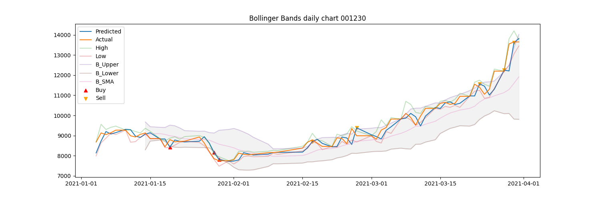

## ValueInvestor

### Background:

We are a portfolio investment company and we make investments in the emerging markets around the world. Our company profits by investing in profitable companies, buying, holding and selling company stocks based on value investing principles.

Our goal is to establish a robust intelligent system to aid our value investing efforts using stock market data. We make investment decisions and based on intrinsic value of companies and do not trade on the basis of daily market volatility. Our profit realization strategy typically involves weekly, monthly and quarterly performance of stocks we buy or hold.

### Data Description:

You are given a set of portfolio companies trading data from emerging markets including 2020 Q1-Q2-Q3-Q4 2021 Q1 stock prices. Each company stock is provided in different sheets. Each market's operating days varies based on the country of the company and the market the stocks are exchanged. Use only 2020 data and predict with 2021 Q1 data. A list of the 8 companies used:

1. Sberbank Rossii PAO(SBER) - Russia.
2. Koc Holding AS (KCHOL) - Turkey.
3. Medinet Masr Housing (MNHD) - Egypt.
4. Minerva SABrazil (BEEF3) - Brazil.
5. Pampa Energia SA (PAMP) - Argentina.
6. Cementos Argos SA (CCB) - Colombia.
7. Impala Platinum (IMPJ) - South Africa.
8. Dongkuk Steel Mil (001230) - South Korea.

### Goal(s):

Predict stock price valuations on a daily, weekly and monthly basis. Recommend BUY, HOLD, SELL decisions. Maximize capital returns, minimize losses. Ideally a loss should never happen. Minimize HOLD period.

Project Overview:

My strategy for this project was to use the ARIMA model for predicting stock market prices, I used the rolling forecast method for my ARIMA model. So after every day/week/month, I would feed the model the new data and forecast the next day/week/month. My approach was to use bollinger bands and if the predicted price was above the upper band that would signal a sell, if it was below the lower band it would signal a buy. 

This is example for one of the markets. In this case, I would buy on the red signals and sell on the orange signals, and I would be able to make a return on my investment if I followed the trading strategy.
